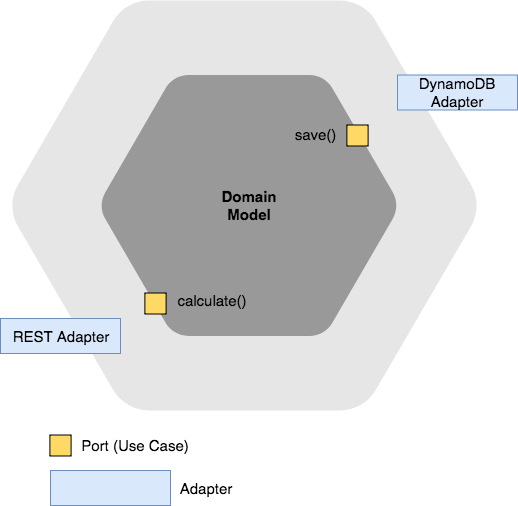

# Hexagonal Architecture Example (Sample)
Basic overview how to use hexagonal architecture with AWS Lambda

* **Domain model (Core Logic):** does not depend on any other layer; all other layers depend on the domain model.

* **Ports (Use Case):** are the medium through which business logic is accessed. Port is a use case boundary i.e. Ports correspond to use-cases in the application. Simplest implementation of a Port can take form of an API / Facade layer (Façade defines a higher-level interface that makes the subsystem easier to use).
	* **Primary Port:** Primary ports are the main API of the application. They are called by the primary adapters that form the user side of the application.
	* **Secondary ports:** are the interfaces for the secondary adapters. They are called by the core logic. An example of a secondary port is an interface to store single objects. This interface simply specifies that an object be created, retrieved, updated, and deleted. It tells you nothing about the way the object is stored.
	* Examples: methods e.g. saveToDatabase(), sendEmailToCustomer(), convertFile()

* **Adapters:** act as a layer which serve the purpose of transforming the communication between various external actors and application logic in such a way that both remain independent. In hexagonal architecture all the primary and secondary actors interact with the application ports through adapters.
	* **Primary adapter:** is a piece of code between the user and the core logic. One adapter could be a unit test function for the core logic. Another could be a controller-like function that interacts both with the graphical user interface and the core logic. The primary adapter calls the API functions of the core logic.
	* **Secondary adapter:** is an implementation of the secondary port (which is an interface). For instance, it can be a small class that converts application storage requests to a given database, and return the results of the database in a format requested by the secondary port. It can also be a mock database object needed to unit tests certain parts of the core logic. The core logic calls the functions of the secondary adapter.
	* Examples: 
		* REST Adapter Web API - interacts with events from AWS Gateway
		* SQL Adapter - interacts with Aurora
		* DynamoDB Adapter - interacts with DynamoDb
		* Email adapter - interacts with emailing system
		* Mocking adapters - You can also have a flat file adapter in case data needs to be persisted in text files and also an adapter for Mocking database for testing which just sits in the memory and acts as database.
		
## Hexagonal Architecture Flow

1. An instance of the application is created, as well as the adapters.
2. The secondary adapters are passed to the core logic (dependency injection).
3. The primary adapters receive a link to the core logic. They start to drive the application.
4. User input is processed by one or more primary adapter(s) and passed to the core logic.
5. The core logic interacts with the secondary adapters only.
6. Output of the core logic is returned to the primary adapters. They feed it back to the user.

[Source](http://codingcanvas.com/hexagonal-architecture/)
[Source](http://www.dossier-andreas.net/software_architecture/ports_and_adapters.html)

---

* The inside of our hexagon consists of three layers: the domain, the application, and the framework.

1. The domain is the central layer which contains all the business logic and business logic constraints.

2. The application layer sits in between the domain and the framework and allows for communication between the two layers. Despite the name, it is NOT the actual application, but rather it applies the commands that the framework receives and sends them to the domain. One could imagine the application layer as the translator between what is received in the framework and the domain, or vice versa. It is important to note that the application layer is not domain specific and it’s also not specific to a specific format of communication. Whether the command was sent in http or Sql, the application handles it in the same way.

3. The framework layer is the outer layer of the hexagonal architecture. It handles communications that are coming from the outside and transfers outside communications into objects that can be utilized in the inner layers.

---
1. Outside the hexagon we have our communications with the system such as http, rest, binary, soap, or other hexagons.

2. The communications these other systems send are received by the framework which transfers these communications into objects that can be worked on.

3. The application then takes the command from the framework and sends it to its specific handler in the domain.

4. The domain responds to the command in a technology independent way and sends its response all the way back to the framework. 

5. The framework will then convert this technology independent response into a technology dependent response.

---

* Each protocol (http, rest, soap, Sql, binary…) our system supports, or each side of the hexagon, represents a “Port” in and out of our application. 

* A port is represented as an interface, its concrete implementation is an adapter of that port. 

* The interface(port) is in one layer, its implementation (adapter) in the next inner layer.

* In hexagonal architecture each layer ‘protects’ itself from the layer around it with a boundary. A boundary divides the layers and allows each one to act independently, you could imagine it a wall. These boundaries force all of the dependencies to come from the outside in.

[Source](https://marcus-biel.com/hexagonal-architecture/)

---

* A port is a consumer agnostic entry and exit point to/from the application. In many languages, it will be an interface.

* An adapter is a class that transforms (adapts) an interface into another.

