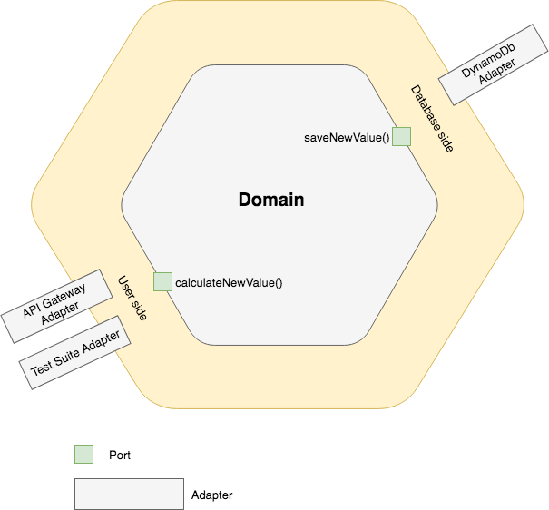

# Hexagonal Architecture Example
Basic overview how to use hexagonal architecture with AWS Lambda

Figure above shows an application having two active ports and several adapters for each port. The two ports are the user side and the database side. The application can be driven by API Gateway or by an automated test suite. These are the driver ports on the left side. On the data side, the infrastructure or service ports on the right. The application can be configured to run decoupled from external databases using an in-memory oracle, or ‘’mock’’, database replacement; or it can run against the test- or run-time database.

## How Does Hexagonal Architecture Work?

* For example when a client POSTs a request to the REST API exposed by our application the Adapter recieves the HTTP request, transforms it into a call onto our Domain, and marshals the response back out to the client over HTTP. Similarly if our application needs to retrieve persisted entity state to initialise the domain it calls out to an Adapter that wraps access to the Db.

## Three Layers of the Hexagonal Architecture
1. **Domain Model:** Contains the main business rules / core logic of the application. It does not depend on any other layer; all other layers depend on the domain model. Independent of any external agency. Independent of the database. Independent of the UI. Independent of frameworks and libraries. Testable. The business rules can be tested without the UI, database, web server, or any other external element.

2. **Ports:** The layer between the Adapter and the Domain is identified as the Ports layer. Our Domain is inside the Port, Adapters for external concerns are on the outside of the port. A port can be thought of as a vector for accepting requests (or data) into an application. For example, an HTTP port (browser requests, API) can make requests on our application. Similarly, a queue worker or other messaging protocol (perhaps AMQP) can also make a request on our application.
		
3. **Adapters:** Act as a layer which serve the purpose of transforming the communication between various external actors and application logic in such a way that both remain independent **(parsing incoming event object & building response)**. In hexagonal architecture all the primary and secondary actors interact with the application ports through adapters.
	* **Primary adapter:** is a piece of code between the user and the core logic. One adapter could be a unit test function for the core logic. Another could be a controller-like function that interacts both with the graphical user interface and the core logic. The primary adapter calls the API functions of the core logic.
		* Examples:
			* REST Adapter Web API - interacts with events from AWS Gateway
			* Test Adapter - running unit and other tests
			* Integration App to App - calls from other apps/services
	* **Secondary adapter:** is an implementation of the secondary port. For instance, it can be a small class that converts application storage requests to a given database, and return the results of the database in a format requested by the secondary port. It can also be a mock database object needed to unit tests certain parts of the core logic. The core logic calls the functions of the secondary adapter.
		* Examples: 
			* Aurora Adapter - interacts with Aurora
			* DynamoDB Adapter - interacts with DynamoDb
			* Mocking adapters - You can also have a flat file adapter in case data needs to be persisted in text files and also an adapter for Mocking database for testing which just sits in the memory and acts as database.
			* Email Adapter - interacts with the email service such as SES
			

## Hexagonal Architecture Flow

1. An instance of the application is created, as well as the adapters.
2. The secondary adapters are passed to the core logic (dependency injection).
3. The primary adapters receive a link to the core logic. They start to drive the application.
4. User input is processed by one or more primary adapter(s) and passed to the core logic.
5. The core logic interacts with the secondary adapters only.
6. Output of the core logic is returned to the primary adapters. They feed it back to the user.

## Rules 

* "Dependency Rule. All dependencies cross the boundary lines in one direction, and they always point toward the components containing the higher-level policy." by Uncle Bob

* Tests should focus on behaviour and by testing directly against a port testing will be ignorant of any user interface in use. A mistake many developers do is testing the internal details of the domain model. This prevents refactoring since changing the implementation details will cause the test to fail. Instead unit testing should be done at the ports boundary which is the public interface that remains inviolate even after changing the implementation details.

* The software in the interface adapters layer is a set of adapters that convert data from the format most convenient for the use cases and entities, to the format most convenient for some external agency such as the database or the web. No code inward of this circle should know anything at all about the database. If the database is a SQL database, then all SQL should be restricted to this layer—and in particular to the parts of this layer that have to do with the database.

* Typically the data that crosses the boundaries consists of simple data structures. You can use basic structs or simple data transfer objects if you like. Or the data can simply be arguments in function calls. Or you can pack it into a hashmap, or construct it into an object. The important thing is that isolated, simple data structures are passed across the boundaries. When we pass data across a boundary, it is always in the form that is most convenient for the inner circle. Many data access frameworks allow database rows and tables to be passed around the system as objects. Allowing this is an architectural error. It couples the use cases, business rules, and in some cases even the UI to the relational structure of the data.

## Some Other Details

* Dependency injection is used to pass the secondary adapters to the core logic
* Secondary ports are implemented as interfaces. Secondary adapters implement these interfaces.
* You could create a factory for adapters for a given service.
* Any input or output of core system is implemented as an adapter (Port being its interface).

## Sources
---
* [Source - Hexagonal Architecture](http://codingcanvas.com/hexagonal-architecture/)
* [Source - Ports and Adapters](http://www.dossier-andreas.net/software_architecture/ports_and_adapters.html)
* [Source - Clean Architecture](https://8thlight.com/blog/uncle-bob/2012/08/13/the-clean-architecture.html)
* [Source - Paramore](https://brightercommand.github.io/Brighter/PortsAndAdapters.html)
* [Source - Exploring the Hexagonal Architecture](https://www.infoq.com/news/2014/10/exploring-hexagonal-architecture)
