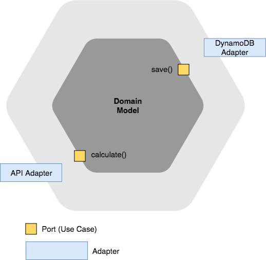

# Hexagonal Architecture Example (Sample)
Basic overview how to use hexagonal architecture with AWS Lambda

> "Dependency Rule. All dependencies cross the boundary lines in one direction, and they always point toward the components containing the higher-level policy." by Uncle Bob

* **Domain model (Core Logic):** does not depend on any other layer; all other layers depend on the domain model.

**Note:** Independent of any external agency. In fact, your business rules don’t know anything at all about the interfaces to the outside world. Independent of the database. You can swap out Oracle or SQL Server for Mongo, BigTable, CouchDB, or something else. Your business rules are not bound to the database. Independent of the UI. The UI can change easily, without changing the rest of the system. A web UI could be replaced with a console UI, for example, without changing the business rules. Testable. The business rules can be tested without the UI, database, web server, or any other external element.

* **Ports (Use Case):** are the medium through which business logic is accessed. Port is a use case boundary i.e. Ports correspond to use-cases in the application. Simplest implementation of a Port can take form of an API / Facade layer (Façade defines a higher-level interface that makes the subsystem easier to use). A port is a consumer agnostic entry and exit point to/from the application. In many languages, it will be an interface (set of functions).
	* **Primary Port:** Primary ports are the main API of the application. They are called by the primary adapters that form the user side of the application.
	* **Secondary ports:** are the interfaces for the secondary adapters. They are called by the core logic. An example of a secondary port is an interface to store single objects. This interface simply specifies that an object be created, retrieved, updated, and deleted. It tells you nothing about the way the object is stored.
		* Examples: methods e.g. saveToDatabase(), sendEmailToCustomer(), convertFile()
		
**Note:** Typically the data that crosses the boundaries consists of simple data structures. You can use basic structs or simple data transfer objects if you like. Or the data can simply be arguments in function calls. Or you can pack it into a hashmap, or construct it into an object. The important thing is that isolated, simple data structures are passed across the boundaries. When we pass data across a boundary, it is always in the form that is most convenient for the inner circle. Many data access frameworks allow database rows and tables to be passed around the system as objects. Allowing this is an architectural error. It couples the use cases, business rules, and in some cases even the UI to the relational structure of the data.

* **Adapters:** act as a layer which serve the purpose of transforming the communication between various external actors and application logic in such a way that both remain independent **(parsing incoming event object & building response)**. In hexagonal architecture all the primary and secondary actors interact with the application ports through adapters.
	* **Primary adapter:** is a piece of code between the user and the core logic. One adapter could be a unit test function for the core logic. Another could be a controller-like function that interacts both with the graphical user interface and the core logic. The primary adapter calls the API functions of the core logic.
	* **Secondary adapter:** is an implementation of the secondary port (which is an interface). For instance, it can be a small class that converts application storage requests to a given database, and return the results of the database in a format requested by the secondary port. It can also be a mock database object needed to unit tests certain parts of the core logic. The core logic calls the functions of the secondary adapter.
		* Examples: 
			* REST Adapter Web API - interacts with events from AWS Gateway
			* SQL Adapter - interacts with Aurora
			* DynamoDB Adapter - interacts with DynamoDb
			* Email adapter - interacts with emailing system
			* Mocking adapters - You can also have a flat file adapter in case data needs to be persisted in text files and also an adapter for Mocking database for testing which just sits in the memory and acts as database.
			
**Note:** The software in the interface adapters layer is a set of adapters that convert data from the format most convenient for the use cases and entities, to the format most convenient for some external agency such as the database or the web. No code inward of this circle should know anything at all about the database. If the database is a SQL database, then all SQL should be restricted to this layer—and in particular to the parts of this layer that have to do with the database.
		
## Hexagonal Architecture Flow

1. An instance of the application is created, as well as the adapters.
2. The secondary adapters are passed to the core logic (dependency injection).
3. The primary adapters receive a link to the core logic. They start to drive the application.
4. User input is processed by one or more primary adapter(s) and passed to the core logic.
5. The core logic interacts with the secondary adapters only.
6. Output of the core logic is returned to the primary adapters. They feed it back to the user.

## Some Other Details

* Dependency injection is used to pass the secondary adapters to the core logic
* Secondary ports are implemented as interfaces. Secondary adapters implement these interfaces.
* You could create a factory for adapters for a given service.

* [Source](http://codingcanvas.com/hexagonal-architecture/)
* [Source](http://www.dossier-andreas.net/software_architecture/ports_and_adapters.html)
